# Database Tables, Relations, and ERD

Tai lieu nay tong hop tat ca cac bang hien co va bang moi da duoc bo sung trong project.

Nguyen tac khi nang cap:

- Khong xoa bang cu.
- Khong xoa cot cu.
- Bang cu duoc giu lai de tuong thich voi code dang chay.
- Bang moi duoc them song song de mo rong cho ecommerce, POS V2, kho, cong no, chat, thong bao, review.

## 1. Bang he thong Laravel

- `users`: tai khoan dang nhap cho admin va khach hang
- `password_reset_tokens`: token quen mat khau
- `sessions`: session dang nhap
- `cache`, `cache_locks`: cache
- `jobs`, `job_batches`, `failed_jobs`: queue
- `migrations`: lich su migration

## 2. Bang nghiep vu cu dang ton tai

- `categories`: danh muc san pham
- `products`: san pham
- `imports`: nhap kho kieu cu
- `sales`: ban hang kieu cu
- `customers`: ho so khach hang
- `customer__debts`: tong cong no kieu cu
- `debt__transactions`: lich su cong no kieu cu
- `cart_items`: gio hang ban dau
- `orders`: don hang online ban dau
- `order_items`: dong san pham cua don online ban dau

## 3. Bang moi da bo sung

### 3.1 Mo rong bang cu

- `users`: them `address`, `status`, `last_login_at`
- `categories`: them `slug`, `is_active`, `sort_order`
- `products`: them `sku`, `list_price`, `sale_price`, `thumbnail_image`, `short_description`, `is_featured`
- `customers`: them `customer_code`, `email`, `default_address`
- `cart_items`: them `cart_id`, `unit_price_snapshot`
- `orders`: them `order_code`, `customer_id`, `subtotal_amount`, `shipping_fee`, `discount_amount`, `grand_total`, `note`, `placed_at`
- `order_items`: them `product_name_snapshot`, `product_sku_snapshot`, `product_image_snapshot`, `unit_price`, `line_total`

### 3.2 Catalog va ecommerce

- `product_images`: nhieu anh cho san pham
- `carts`: header gio hang
- `customer_addresses`: dia chi cua khach
- `order_addresses`: snapshot dia chi cua don
- `order_payments`: thanh toan don hang online
- `order_status_histories`: lich su trang thai don

### 3.3 Engagement

- `conversations`: hoi thoai user-shop
- `messages`: tin nhan trong hoi thoai
- `notifications`: thong bao cho user
- `reviews`: danh gia san pham

### 3.4 POS V2

- `sale_invoices`: hoa don ban hang V2
- `sale_items`: dong san pham cua hoa don V2
- `sale_payments`: thu tien cua hoa don V2
- `customer_debt_balances`: tong hop cong no V2
- `debt_transactions`: lich su cong no V2

### 3.5 Inventory V2

- `import_receipts`: phieu nhap V2
- `import_items`: dong nhap kho V2
- `inventory_movements`: so cai ton kho

## 4. Moi lien ket chinh

### 4.1 User va customer

- `users` 1-1 `customers` qua `customers.user_id`
- `users` 1-n `carts`
- `users` 1-n `orders`
- `users` 1-n `conversations`
- `users` 1-n `messages` qua `sender_id`
- `users` 1-n `notifications`
- `users` 1-n `reviews`
- `customers` 1-n `customer_addresses`
- `customers` 1-n `orders`
- `customers` 1-n `sale_invoices`
- `customers` 1-1 `customer_debt_balances`
- `customers` 1-n `debt_transactions`

### 4.2 Product va catalog

- `categories` 1-n `products`
- `products` 1-n `product_images`
- `products` 1-n `cart_items`
- `products` 1-n `order_items`
- `products` 1-n `sale_items`
- `products` 1-n `import_items`
- `products` 1-n `inventory_movements`
- `products` 1-n `reviews`

### 4.3 Gio hang va dat hang

- `carts` 1-n `cart_items`
- `orders` 1-n `order_items`
- `orders` 1-1 `order_addresses`
- `orders` 1-n `order_payments`
- `orders` 1-n `order_status_histories`
- `order_items` 1-n `reviews`

### 4.4 Chat va thong bao

- `conversations` 1-n `messages`
- `users` 1-n `notifications`

### 4.5 POS, cong no, kho

- `sale_invoices` 1-n `sale_items`
- `sale_invoices` 1-n `sale_payments`
- `sale_invoices` 1-n `debt_transactions`
- `import_receipts` 1-n `import_items`
- `products` 1-n `inventory_movements`

## 5. Ghi chu tuong thich

- `sales`, `imports`, `customer__debts`, `debt__transactions` van duoc giu lai.
- `cart_items.user_id` van duoc giu lai, dong thoi da them `cart_id` cho mo hinh moi.
- `orders.total_amount`, `order_items.price`, `products.image`, `customers.address` van duoc giu lai de tuong thich.
- Cac bang V2 la huong chuan hoa de migrate logic dan dan, khong ep buoc phai rewrite ngay.

## 6. ERD tong hop

```mermaid
erDiagram
    USERS ||--o| CUSTOMERS : has_profile
    USERS ||--o{ CARTS : owns
    USERS ||--o{ ORDERS : places
    USERS ||--o{ CONVERSATIONS : opens
    USERS ||--o{ MESSAGES : sends
    USERS ||--o{ NOTIFICATIONS : receives
    USERS ||--o{ REVIEWS : writes
    USERS ||--o{ SALE_INVOICES : creates
    USERS ||--o{ IMPORT_RECEIPTS : creates
    USERS ||--o{ INVENTORY_MOVEMENTS : creates

    CUSTOMERS ||--o{ CUSTOMER_ADDRESSES : has
    CUSTOMERS ||--o{ ORDERS : places_as_customer
    CUSTOMERS ||--o{ SALE_INVOICES : buys
    CUSTOMERS ||--|| CUSTOMER_DEBT_BALANCES : has
    CUSTOMERS ||--o{ DEBT_TRANSACTIONS : logs

    CATEGORIES ||--o{ PRODUCTS : contains
    PRODUCTS ||--o{ PRODUCT_IMAGES : has
    PRODUCTS ||--o{ CART_ITEMS : in_cart
    PRODUCTS ||--o{ ORDER_ITEMS : ordered
    PRODUCTS ||--o{ SALE_ITEMS : sold
    PRODUCTS ||--o{ IMPORT_ITEMS : imported
    PRODUCTS ||--o{ INVENTORY_MOVEMENTS : moves
    PRODUCTS ||--o{ REVIEWS : receives

    CARTS ||--o{ CART_ITEMS : has

    ORDERS ||--o{ ORDER_ITEMS : has
    ORDERS ||--|| ORDER_ADDRESSES : ships_to
    ORDERS ||--o{ ORDER_PAYMENTS : paid_by
    ORDERS ||--o{ ORDER_STATUS_HISTORIES : tracks

    ORDER_ITEMS ||--o{ REVIEWS : may_have

    CONVERSATIONS ||--o{ MESSAGES : has

    SALE_INVOICES ||--o{ SALE_ITEMS : has
    SALE_INVOICES ||--o{ SALE_PAYMENTS : paid_by
    SALE_INVOICES ||--o{ DEBT_TRANSACTIONS : affects

    IMPORT_RECEIPTS ||--o{ IMPORT_ITEMS : has

    PRODUCTS ||--o{ SALES : legacy_sales
    PRODUCTS ||--o{ IMPORTS : legacy_imports
    CUSTOMERS ||--o{ SALES : legacy_customer_sales
    CUSTOMERS ||--|| CUSTOMER__DEBTS : legacy_debt
    CUSTOMERS ||--o{ DEBT__TRANSACTIONS : legacy_debt_logs
```

## 7. Cac model moi da co

- `Cart`
- `ProductImage`
- `CustomerAddress`
- `OrderAddress`
- `OrderPayment`
- `OrderStatusHistory`
- `Conversation`
- `Message`
- `StoreNotification`
- `Review`
- `SaleInvoice`
- `SaleItem`
- `SalePayment`
- `CustomerDebtBalance`
- `DebtTransaction`
- `ImportReceipt`
- `ImportItem`
- `InventoryMovement`

## 8. Ket luan

Schema hien tai da duoc nang cap de:

- them mua hang online day du hon
- them dang ky va quan ly khach hang
- them nhieu anh san pham
- them chat, thong bao, review
- them huong POS V2 va inventory V2

Tat ca deu dang o trang thai "mo rong an toan", chua dong vao cac bang legacy.
