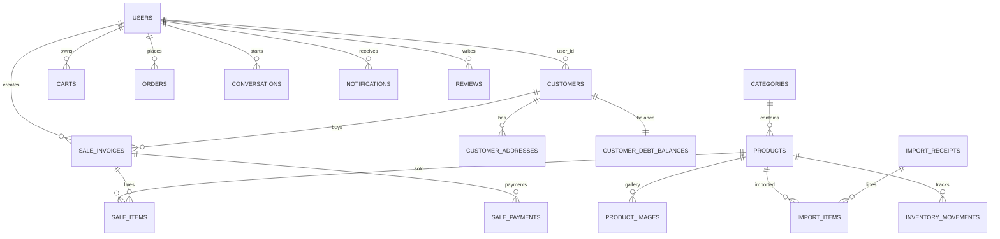

# DB Schema Complete Guide - KhoaQuyenStore V2 (1 file/table)

## Tổng quan
- **Legacy tables** (v1 POS): sales, imports, customer__debts...
- **V2 expansions**: sale_invoices, import_receipts, inventory_movements...
- **Online features**: carts, orders expansions, chat, reviews.

## Danh sách tất cả tables (purpose, relations)

### 1. Core
**users**: Tài khoản admin/customer
- Relations: customers, carts, orders, conversations...
**customers**: Hồ sơ khách (POS/online)
- Relations: user_id → users, customer_addresses, sale_invoices...

### 2. Catalog
**categories**: Danh mục SP (expanded slug, is_active)
**products**: Sản phẩm trung tâm (expanded sku, sale_price...)
- Relations: category, product_images, sale_items, inventory_movements...

**product_images**: Gallery ảnh SP
- product_id → products

### 3. Cart/Online
**carts**: Header giỏ hàng
**cart_items**: Items (expanded cart_id)
**orders**: Header đơn online (expanded pricing)
**order_items**: Items (snapshots)
**order_addresses**: Snapshot giao hàng
**order_payments**: Thanh toán
**order_status_histories**: Lịch sử trạng thái

### 4. Engagement
**conversations**: Hồi thoại user-shop
**messages**: Tin nhắn
**notifications**: Thống báo
**reviews**: Đánh giá SP

### 5. POS V2
**sale_invoices**: Header hóa đơn
**sale_items**: Lines
**sale_payments**: Thu tiền
**customer_debt_balances**: Tổng nợ
**debt_transactions**: Lịch sử nợ

### 6. Inventory V2
**import_receipts**: Phieu nhập
**import_items**: Lines
**inventory_movements**: Biến động kho

## ERD Diagram

