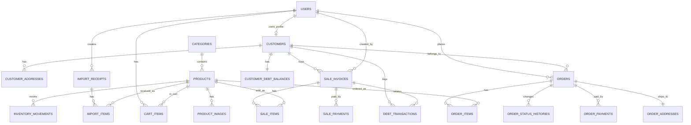

# Database V2 Proposal

Tai lieu nay de xuat schema moi cho `KhoaQuyenStore` theo huong:

- Ban tai quay va ban online dung chung mot mo hinh du lieu.
- Khach hang co tai khoan, dang ky, dang nhap, dat hang online.
- Kho, cong no, thanh toan, don hang va hoa don duoc tach ro phan header va line item.
- Chua dua vao project. Day la ban thiet ke de duyet truoc khi viet migration.

## 1. Muc tieu nang cap

Schema hien tai da co du cac bang MVP cho:

- `users`
- `customers`
- `categories`
- `products`
- `imports`
- `sales`
- `customer__debts`
- `debt__transactions`
- `cart_items`
- `orders`
- `order_items`

Nhung de phat trien them ecommerce va auth khach hang, schema hien tai gap 4 van de lon:

1. `sales` dang vua dong vai tro hoa don vua dong vai tro dong san pham.
2. `imports` dang vua dong vai tro phieu nhap vua dong vai tro dong nhap.
3. `orders` hien tai qua toi gian cho thanh toan online, lich su trang thai, dia chi giao hang, snapshot san pham.
4. `products` chi co 1 truong anh, khong phu hop cho gallery san pham online.

## 2. Dinh huong thiet ke moi

Schema V2 tach ro 5 nhom:

- `catalog`: danh muc, san pham, anh san pham
- `identity`: tai khoan, profile khach, dia chi
- `commerce`: gio hang, don hang, item, payment, history
- `pos`: hoa don tai quay, item, payment, cong no
- `inventory`: phieu nhap, dong nhap, so kho

Huong nay giup:

- Online va offline dung chung `products`, `customers`, `inventory`.
- POS co the linh hoat hon `orders`, vi mot hoa don tai quay khong giong mot don online.
- Don online va hoa don POS van co the quy ve cung mot ledger ton kho.

## 3. Danh sach bang de xuat

### 3.1 Identity va khach hang

#### `users`

Giữ bang nay nhung nang cap them de phuc vu auth khach hang:

- `id`
- `name`
- `email` unique
- `password`
- `role` enum: `admin`, `customer`
- `phone` nullable, unique neu muon dung dang nhap bang so dien thoai
- `email_verified_at`
- `status` enum: `active`, `blocked`
- `last_login_at` nullable
- `created_at`
- `updated_at`

Vai tro:

- Tai khoan dang nhap cho admin va khach hang.
- Khach mua online se gan voi `users`.

#### `customers`

Bang nghiep vu khach hang, khong chi la tai khoan auth:

- `id`
- `user_id` nullable, FK -> `users.id`
- `customer_code` unique
- `name`
- `phone`
- `email` nullable
- `default_address` nullable
- `note` nullable
- `created_at`
- `updated_at`

Vai tro:

- Dung chung cho khach POS va khach online.
- Khach vang lai co the chi co `customers`, khong can `users`.
- Khach dang ky online se co ca `users` va `customers`.

De xuat:

- `phone` nen unique neu ban muon moi so dien thoai la mot khach duy nhat.
- Neu nghiep vu co truong hop mot nguoi dung nhieu so, khong nen unique va can co quy tac merge customer.

#### `customer_addresses`

Bang moi cho ecommerce:

- `id`
- `customer_id`, FK -> `customers.id`
- `recipient_name`
- `recipient_phone`
- `province_code`
- `district_code`
- `ward_code`
- `address_line`
- `is_default`
- `created_at`
- `updated_at`

Vai tro:

- Mot khach co nhieu dia chi giao hang.
- Khong nen de toan bo dia chi trong `orders`.

### 3.2 Catalog va san pham

#### `categories`

Giữ, co the bo sung:

- `slug` unique
- `is_active`
- `sort_order`

#### `products`

Giữ bang nay nhung nang cap de ban online:

- `id`
- `category_id`, FK -> `categories.id`
- `name`
- `slug` unique
- `sku` unique
- `brand` nullable
- `model` nullable
- `list_price`
- `sale_price`
- `stock` cache
- `warranty_months`
- `short_description` nullable
- `description` nullable
- `thumbnail_image` nullable
- `is_active`
- `is_featured`
- `created_at`
- `updated_at`

Luu y:

- `thumbnail_image` la anh dai dien.
- Truong anh thu 2 khong nen them truc tiep vao bang nay neu ban dang di theo huong online lau dai.

#### `product_images`

Bang moi de giai quyet yeu cau them anh san pham:

- `id`
- `product_id`, FK -> `products.id`
- `image_path`
- `alt_text` nullable
- `sort_order`
- `is_primary`
- `created_at`
- `updated_at`

Vai tro:

- Mot san pham co nhieu anh.
- `is_primary = 1` la anh chinh.
- `sort_order` de sap xep gallery.

Neu ban chi can them 1 anh phu trong giai doan dau:

- Van co the them `secondary_image` vao `products`.
- Nhung cho muc tieu ecommerce, `product_images` la lua chon dung hon.

### 3.3 Gio hang va dat hang online

#### `cart_items`

Giữ bang nay, bo sung rang buoc:

- `id`
- `user_id`, FK -> `users.id`
- `product_id`, FK -> `products.id`
- `quantity`
- `created_at`
- `updated_at`

Rang buoc:

- unique (`user_id`, `product_id`)

Vai tro:

- Moi user chi co 1 dong cart cho 1 san pham.

#### `orders`

Bang don hang online moi nen co:

- `id`
- `order_code` unique
- `user_id` nullable, FK -> `users.id`
- `customer_id` nullable, FK -> `customers.id`
- `status` enum: `pending`, `confirmed`, `packing`, `shipping`, `completed`, `cancelled`, `returned`
- `payment_method` enum: `cod`, `bank_transfer`, `gateway`
- `payment_status` enum: `pending`, `partial`, `paid`, `failed`, `refunded`
- `subtotal_amount`
- `shipping_fee`
- `discount_amount`
- `grand_total`
- `note` nullable
- `placed_at`
- `created_at`
- `updated_at`

Vai tro:

- Bang header cho don online.
- `customer_id` dung de map sang nghiep vu khach hang.
- `user_id` dung cho auth, co the nullable neu sau nay muon guest checkout.

#### `order_items`

Bang dong san pham cua don online:

- `id`
- `order_id`, FK -> `orders.id`
- `product_id`, FK -> `products.id`
- `product_name_snapshot`
- `product_sku_snapshot`
- `product_image_snapshot` nullable
- `quantity`
- `unit_price`
- `line_total`
- `created_at`
- `updated_at`

Vai tro:

- Luu snapshot tai thoi diem dat hang.
- Neu sau nay san pham doi ten, doi gia, doi anh thi don cu van giu du lich su dung.

#### `order_addresses`

De xuat tach dia chi giao hang khoi `orders`:

- `id`
- `order_id`, FK -> `orders.id`
- `recipient_name`
- `recipient_phone`
- `province_code`
- `district_code`
- `ward_code`
- `address_line`
- `created_at`
- `updated_at`

Vai tro:

- Snapshot dia chi tai thoi diem dat hang.
- Khong phu thuoc vao `customer_addresses` sau khi khach sua dia chi.

#### `order_status_histories`

Bang moi cho luong ecommerce:

- `id`
- `order_id`, FK -> `orders.id`
- `status`
- `note` nullable
- `changed_by` nullable, FK -> `users.id`
- `created_at`

Vai tro:

- Theo doi lich su xu ly don hang.
- Rat can thiet neu ban muon co trang thai cho admin va cho khach.

#### `order_payments`

Bang moi neu ban muon thanh toan online:

- `id`
- `order_id`, FK -> `orders.id`
- `method`
- `provider` nullable
- `transaction_code` nullable
- `amount`
- `status` enum: `pending`, `paid`, `failed`, `refunded`
- `paid_at` nullable
- `raw_payload` nullable JSON
- `created_at`
- `updated_at`

Vai tro:

- Khong nen nhet het chi tiet thanh toan vao `orders`.
- Phu hop khi sau nay tich hop VNPay, Momo, chuyen khoan, QR.

### 3.4 POS va hoa don tai quay

#### `sale_invoices`

Bang moi thay the vai tro header cua `sales`:

- `id`
- `invoice_code` unique
- `customer_id` nullable, FK -> `customers.id`
- `created_by`, FK -> `users.id`
- `channel` enum: `pos`, `online_manual`
- `status` enum: `draft`, `completed`, `cancelled`, `refunded`
- `subtotal_amount`
- `discount_amount`
- `grand_total`
- `paid_amount`
- `debt_amount`
- `note` nullable
- `sold_at`
- `created_at`
- `updated_at`

Vai tro:

- Mot hoa don co nhieu dong san pham.
- Khac `orders` o cho nghiep vu tai quay co the phat sinh cong no, thu tien nhieu lan, huy nhanh, tra hang.

#### `sale_items`

Bang moi thay the vai tro dong san pham cua `sales`:

- `id`
- `sale_invoice_id`, FK -> `sale_invoices.id`
- `product_id`, FK -> `products.id`
- `product_name_snapshot`
- `quantity`
- `unit_price`
- `line_total`
- `created_at`
- `updated_at`

#### `sale_payments`

Bang moi cho thu tien hoa don:

- `id`
- `sale_invoice_id`, FK -> `sale_invoices.id`
- `method` enum: `cash`, `bank_transfer`, `card`, `other`
- `amount`
- `reference` nullable
- `paid_at`
- `created_at`
- `updated_at`

Vai tro:

- Ho tro partial payment.
- Mot hoa don co the thu nhieu lan bang nhieu hinh thuc.

### 3.5 Cong no

#### `customer_debt_balances`

Bang moi thay cho `customer__debts`:

- `id`
- `customer_id`, unique FK -> `customers.id`
- `balance_amount`
- `last_transaction_at` nullable
- `created_at`
- `updated_at`

Vai tro:

- Bang tong hop de query nhanh.
- Du lieu goc van nen nam o bang transaction.

#### `debt_transactions`

Bang moi thay cho `debt__transactions`:

- `id`
- `customer_id`, FK -> `customers.id`
- `sale_invoice_id` nullable, FK -> `sale_invoices.id`
- `type` enum: `increase`, `payment`, `adjustment`, `refund`
- `amount`
- `description` nullable
- `occurred_at`
- `created_by` nullable, FK -> `users.id`
- `created_at`
- `updated_at`

Vai tro:

- Ledger cong no.
- Giao dich cong no gan voi hoa don, khong gan voi mot dong san pham nhu `sale_id` hien tai.

### 3.6 Kho va ton kho

#### `import_receipts`

Bang moi thay cho phan header cua `imports`:

- `id`
- `receipt_code` unique
- `created_by`, FK -> `users.id`
- `supplier_name` nullable
- `note` nullable
- `received_at`
- `created_at`
- `updated_at`

#### `import_items`

Bang moi thay cho dong nhap kho:

- `id`
- `import_receipt_id`, FK -> `import_receipts.id`
- `product_id`, FK -> `products.id`
- `quantity`
- `unit_cost` nullable
- `line_cost` nullable
- `note` nullable
- `created_at`
- `updated_at`

#### `inventory_movements`

Bang moi rat quan trong cho ca offline va online:

- `id`
- `product_id`, FK -> `products.id`
- `movement_type` enum: `import`, `sale`, `order_reserve`, `order_release`, `return`, `adjustment`
- `quantity_delta`
- `reference_type`
- `reference_id`
- `note` nullable
- `occurred_at`
- `created_by` nullable, FK -> `users.id`
- `created_at`
- `updated_at`

Vai tro:

- So cai ton kho.
- `products.stock` chi nen la cache de query nhanh.
- Moi lan nhap, ban, huy don, tra hang deu tao movement.

## 4. So sanh bang cu va bang moi

| Bang hien tai | Van de | Bang V2 de xuat |
|---|---|---|
| `sales` | Tron header va item, lap `paid_amount`, kho mo rong | `sale_invoices`, `sale_items`, `sale_payments` |
| `imports` | Tron phieu nhap va dong nhap | `import_receipts`, `import_items` |
| `customer__debts` | Naming xau, chi la tong hop | `customer_debt_balances` |
| `debt__transactions` | Dang gan vao `sale_id` cap dong | `debt_transactions` gan vao `sale_invoice_id` |
| `products.image` | Chi co 1 anh | `products.thumbnail_image` + `product_images` |
| `orders` | Chua du thong tin online | `orders`, `order_items`, `order_addresses`, `order_payments`, `order_status_histories` |
| `cart_items` | Chua co unique theo user va product | `cart_items` giu nguyen, them unique |
| `customers` | Chua ro cho online auth va dia chi | `customers` + `customer_addresses` |

## 5. Quan he chinh

## 6. Rang buoc va index toi thieu

- `users.email` unique
- `users.phone` unique neu dung de login
- `customers.customer_code` unique
- `products.slug` unique
- `products.sku` unique
- `product_images`: index (`product_id`, `sort_order`)
- `cart_items`: unique (`user_id`, `product_id`)
- `orders.order_code` unique
- `order_items`: index (`order_id`), (`product_id`)
- `order_payments`: index (`order_id`, `status`)
- `sale_invoices.invoice_code` unique
- `sale_items`: index (`sale_invoice_id`), (`product_id`)
- `sale_payments`: index (`sale_invoice_id`, `paid_at`)
- `customer_debt_balances.customer_id` unique
- `debt_transactions`: index (`customer_id`, `occurred_at`)
- `import_receipts.receipt_code` unique
- `import_items`: index (`import_receipt_id`), (`product_id`)
- `inventory_movements`: index (`product_id`, `occurred_at`), (`reference_type`, `reference_id`)

## 7. Lo trinh nang cap tu schema hien tai

Khong nen rewrite mot lan. Nen chia 3 phase:

### Phase 1: Nang cap ecommerce

- Them `product_images`
- Nang cap `orders`
- Nang cap `order_items`
- Them `customer_addresses`
- Them `order_addresses`
- Them `order_payments`
- Them `order_status_histories`
- Rang buoc unique cho `cart_items`

Muc tieu:

- Khach dang ky, dang nhap, them gio hang, dat hang online.

### Phase 2: Chuan hoa POS

- Tao `sale_invoices`
- Tao `sale_items`
- Tao `sale_payments`
- Chuyen logic hien tai tu `sales` sang schema moi

Muc tieu:

- Ban tai quay dung chuan hoa don va thanh toan.

### Phase 3: Chuan hoa kho va cong no

- Tao `import_receipts`
- Tao `import_items`
- Tao `inventory_movements`
- Tao `customer_debt_balances`
- Tao `debt_transactions`
- Migrate du lieu tu `imports`, `customer__debts`, `debt__transactions`

Muc tieu:

- Audit ton kho va cong no ro rang, mo rong an toan.

## 8. Ket luan

Neu muc tieu cua ban la:

- Ban tai quay
- Ban online
- Khach dang ky, dang nhap
- Nhieu anh cho san pham
- Don hang co thanh toan, giao hang, lich su trang thai

Thi schema V2 nen di theo huong:

- `products` + `product_images`
- `users` + `customers` + `customer_addresses`
- `orders` + `order_items` + `order_addresses` + `order_payments` + `order_status_histories`
- `sale_invoices` + `sale_items` + `sale_payments`
- `import_receipts` + `import_items`
- `inventory_movements`
- `customer_debt_balances` + `debt_transactions`

Ban nay chi la proposal. Chua tac dong den migration hien tai.
